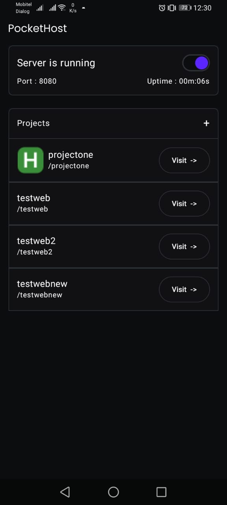
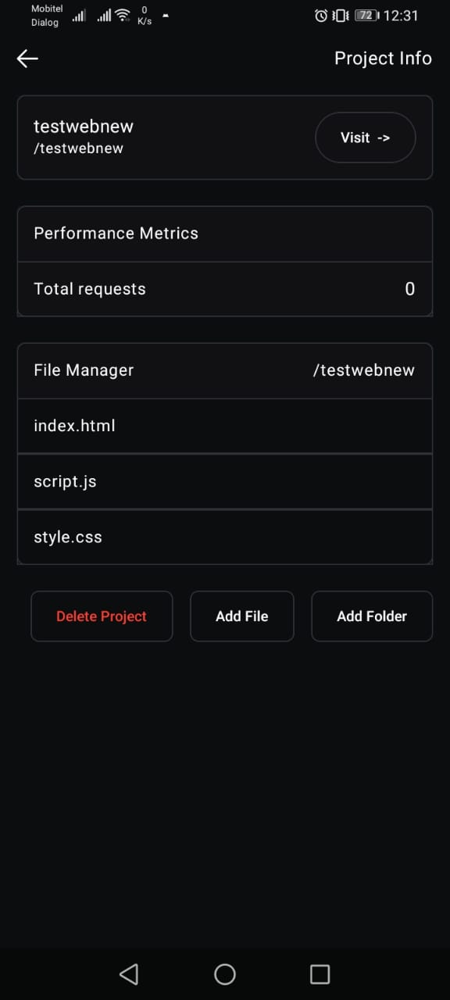
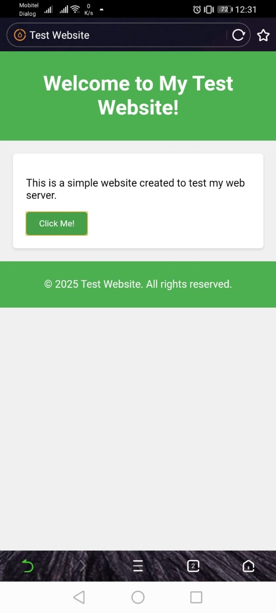
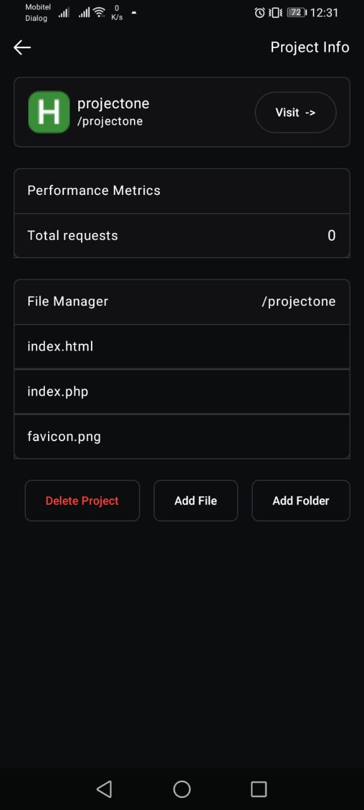
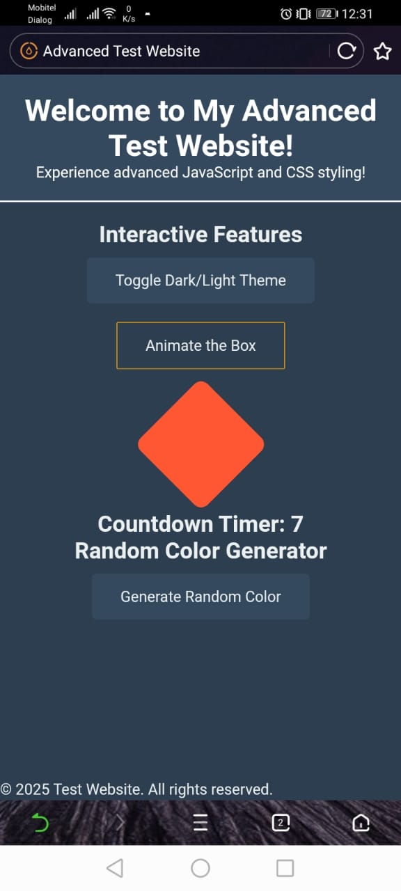

# PocketHost: Simple Static Web Server for Android

**PocketHost** is an Android app that lets you easily host and view static web pages (HTML, CSS, JS) directly from your device. It runs a lightweight web server, allowing you to test and showcase your static websites locally.

## Features:
- Host static web pages (HTML, CSS, JavaScript).
- Lightweight and easy to use.
- Simple local server setup.

## Screenshots:

    
    
    
    
    

## Technologies Used:
- **Android**: Java+Kotlin Android app.
- **NanoHTTPD**: Lightweight HTTP server for serving static web content.
